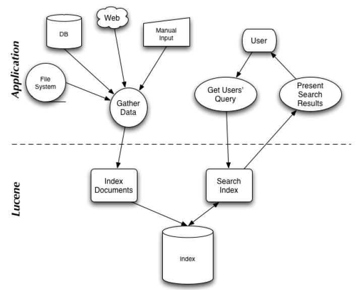
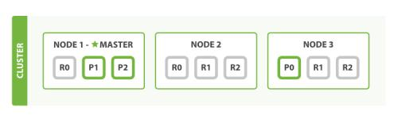
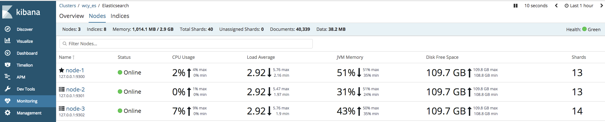
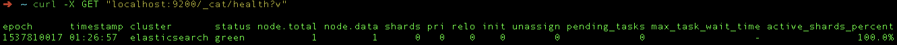

**Directory**

[TOC]

# [Elasticsearch](https://www.elastic.co/guide/en/elasticsearch/reference/current/getting-started.html)

> Elasticsearch is a highly scalable open-source full-text search and analytics engine. It allows you to store, search, and analyze big volumes of data quickly and in near real time. It is generally used as the underlying engine/technology that powers applications that have complex search features and requirements.

Elasticsearch是基于[Apache Lucene(TM)](https://lucene.apache.org/)的开源搜索引擎，它采用Java编写并使用Lucene构建索引、提供检索功能。Elasticsearch对Lucene进行了一次封装，屏蔽了Lucene使用的复杂性，提供了更高层次的抽象方法，使得它开箱即用。Elasticsearch产生的目的是让全文搜索变得简单，使用者可以通过简单的RESTful API轻松实现搜索功能。除了全文检索之外，它还有如下功能：

- 分布式的实时文件存储，每个字段都能被索引和搜索

- 分布式的实时分析引擎

- 可以扩展到上百台服务器，处理PB级别的结构化或非结构化的数据

Elasticsearch一般与[Kibana](https://www.elastic.co/guide/en/kibana/current/introduction.html)和[Logstash](https://www.elastic.co/guide/en/logstash/current/introduction.html)搭配使用。

Kibana:

> Kibana is an open source analytics and visualization platform designed to work with Elasticsearch. You use Kibana to search, view, and interact with data stored in Elasticsearch indices. You can easily perform advanced data analysis and visualize your data in a variety of charts, tables, and maps.

Logstash:

> Logstash is an open source data collection engine with real-time pipelining capabilities. Logstash can dynamically unify data from disparate sources and normalize the data into destinations of your choice. Cleanse and democratize all your data for diverse advanced downstream analytics and visualization use cases.

## Background

Elasticsearch的创建者是Shay Banon，在一次采访中，在谈到为什么会接触Lucene并开发Elasticsearch的时候，Shay Banon认为自己参与Lucene完全是一种偶然，当年他还是一个待业工程师，跟随自己的新婚妻子来到伦敦，妻子想在伦敦学习做一名厨师，而自己则想为妻子开发一个方便搜索菜谱的应用，所以才接触到Lucene。直接使用Lucene构建搜索有很多问题，包含大量重复性的工作，所以Shay便在Lucene的基础上不断地进行抽象，让Java程序嵌入搜索变得更容易，经过一段时间的打磨便诞生了他的第一个开源作品“Compass”，中文即“指南针”的意思。之后，Shay找到了一份面对高性能分布式开发环境的新工作，在工作中他渐渐发现越来越需要一个易用的、高性能、实时、分布式搜索服务，于是他决定重写Compass，将它从一个库打造成了一个独立的server，并将其改名为Elasticsearch。

### Lucene

Lucene是一套用于全文检索和搜寻的开放源码程式库，是一个基于 Java 的全文信息检索工具包，它不是一个完整的搜索应用程序，而是为你的应用程序提供索引和搜索功能。



索引是现代搜索引擎的核心，建立索引的过程就是把源数据处理成非常方便查询的索引文件的过程。为什么索引这么重要呢，试想你现在要在大量的文档中搜索含有某个关键词的文档，那么如果不建立索引的话你就需要把这些文档顺序的读入内存，然后检查这个文章中是不是含有要查找的关键词，这样的话就会耗费非常多的时间，想想搜索引擎可是在毫秒级的时间内查找出要搜索的结果的。这就是由于建立了索引的原因，你可以把索引想象成这样一种数据结构，他能够使你快速的随机访问存储在索引中的关键词，进而找到该关键词所关联的文档。Lucene 采用的是一种称为反向索引（inverted index）的机制。反向索引就是说我们维护了一个词 / 短语表，对于这个表中的每个词 / 短语，都有一个链表描述了有哪些文档包含了这个词 / 短语。这样在用户输入查询条件的时候，就能非常快的得到搜索结果。

对文档建立好索引后，就可以在这些索引上面进行搜索了。搜索引擎首先会对搜索的关键词进行解析，然后再在建立好的索引上面进行查找，最终返回和用户输入的关键词相关联的文档。

Lucene最初是由Doug Cutting所撰写的，他是一位资深的全文索引及检索专家。Doug Cutting 利用 Google 公开的技术扩充他已经开发出来的 Lucene 搜索技术，进而打造出了 Hadoop。

## Basic Concepts

There are a few concepts that are core to Elasticsearch. Understanding these concepts from the outset will tremendously help ease the learning process.

### Near Realtime(NRT)

Elasticsearch is a near real time search platform. What this means is there is a slight latency (normally one second) from the time you index a document until the time it becomes searchable.

### Cluster

A cluster is a collection of one or more nodes (servers) that together holds your entire data and provides federated indexing and search capabilities across all nodes.



### Node

A node is a single server that is part of your cluster, stores your data, and participates in the cluster’s indexing and search capabilities.

### Index

An index is a collection of documents that have somewhat similar characteristics.

### Type

> Deprecated in 6.0.0.

A type used to be a logical category/partition of your index to allow you to store different types of documents in the same index, eg one type for users, another type for blog posts. It is no longer possible to create multiple types in an index, and the whole concept of types will be removed in a later version. See [Removal of mapping types](https://www.elastic.co/guide/en/elasticsearch/reference/6.4/removal-of-types.html#_alternatives_to_mapping_types) for more.

### Document

A document is a basic unit of information that can be indexed.This document is expressed in JSON (JavaScript Object Notation) which is a ubiquitous internet data interchange format.

> index,type,document与关系型数据库的对应关系

| Elasticsearch | SQL_DB |
| ------------- | ------ |
| index         | 数据库名称  |
| type          | 表名     |
| document      | 一条记录   |

> 需要注意的是：在6.0版本之前，Elasticsearch中一个index可以对应多个type，类似于SQL中一个数据库可以拥有多张表。在6.0版本之后，Elasticsearch中一个index只能对应一个type，也就说一个数据库中只能拥有一个表。

### Shards & Replicas

An index can potentially store a large amount of data that can exceed the hardware limits of a single node. For example, a single index of a billion documents taking up 1TB of disk space may not fit on the disk of a single node or may be too slow to serve search requests from a single node alone.

To solve this problem, Elasticsearch provides the ability to subdivide your index into multiple pieces called shards. When you create an index, you can simply define the number of shards that you want. Each shard is in itself a fully-functional and independent "index" that can be hosted on any node in the cluster.

Sharding is important for two primary reasons:

- It allows you to horizontally split/scale your content volume

- It allows you to distribute and parallelize operations across shards (potentially on multiple nodes) thus increasing performance/throughput

In a network/cloud environment where failures can be expected anytime, it is very useful and highly recommended to have a failover mechanism in case a shard/node somehow goes offline or disappears for whatever reason. To this end, Elasticsearch allows you to make one or more copies of your index’s shards into what are called replica shards, or replicas for short.

Replication is important for two primary reasons:

- It provides high availability in case a shard/node fails. For this reason, it is important to note that a replica shard is never allocated on the same node as the original/primary shard that it was copied from.

- It allows you to scale out your search volume/throughput since searches can be executed on all replicas in parallel.

## Distribution

Elasticsearch为分布式而生，而且它的设计隐藏了分布式本身的复杂性，在分布式概念上做了很大程度上的透明化。

以下这些操作都是在底层自动完成的：

- 将你的文档分区到不同的容器或者分片(shards)中，它们可以存在于一个或多个节点中。

- 将分片均匀的分配到各个节点，对索引和搜索做负载均衡。

- 冗余每一个分片，防止硬件故障造成的数据丢失。

- 将集群中任意一个节点上的请求路由到相应数据所在的节点。

- 无论是增加节点，还是移除节点，分片都可以做到无缝的扩展和迁移。

### Cluster

如果我们启动一个单独的节点，它还没有数据和索引，如下图：


一个节点(node)就是一个Elasticsearch实例，而一个集群(cluster)由一个或多个节点组成，它们具有相同的cluster.name，它们协同工作，分享数据和负载。当加入新的节点或者删除一个节点时，集群就会感知到并平衡数据。

集群中一个节点会被选举为主节点(master),它将临时管理集群级别的一些变更，例如新建或删除索引、增加或移除节点等。主节点不参与文档级别的变更或搜索，这意味着在流量增长的时候，该主节点不会成为集群的瓶颈。任何节点都可以成为主节点。我们例子中的集群只有一个节点，所以它会充当主节点的角色。

做为用户，我们能够与集群中的任何节点通信，包括主节点。每一个节点都知道文档存在于哪个节点上，它们可以转发请求到相应的节点上。我们访问的节点负责收集各节点返回的数据，最后一起返回给客户端。这一切都由Elasticsearch处理。

### Indexing

为了将数据添加到Elasticsearch，我们需要索引(index)——一个存储关联数据的地方。实际上，索引只是一个用来指向一个或多个分片(shards)的“逻辑命名空间(logical namespace)”.


一个分片(shard)是一个最小级别“工作单元(worker unit)”,它只是保存了索引中所有数据的一部分。分片就是一个Lucene实例，并且它本身就是一个完整的搜索引擎。我们的文档存储在分片中，并且在分片中被索引，但是我们的应用程序不会直接与它们通信，取而代之的是，直接与索引通信。

分片是Elasticsearch在集群中分发数据的关键。把分片想象成数据的容器。文档存储在分片中，然后分片分配到你集群中的节点上。当你的集群扩容或缩小，Elasticsearch将会自动在你的节点间迁移分片，以使集群保持平衡。

分片可以是主分片(primary shard)或者是复制分片(replica shard)。你索引中的每个文档属于一个单独的主分片，所以主分片的数量决定了索引最多能存储多少数据。

理论上主分片能存储的数据大小是没有限制的，限制取决于你实际的使用情况。分片的最大容量完全取决于你的使用状况：硬件存储的大小、文档的大小和复杂度、如何索引和查询你的文档，以及你期望的响应时间。

复制分片只是主分片的一个副本，它可以防止硬件故障导致的数据丢失，同时可以提供读请求，比如搜索或者从别的shard取回文档。

当索引创建完成的时候，主分片的数量就固定了，但是复制分片的数量可以随时调整。

## Horizontal Scale

随着应用需求的增长，我们该如何扩展？如果我们启动第三个节点，我们的集群会重新组织自己。


Node3包含了分别来自Node 1和Node 2的一个分片，这样每个节点就有两个分片，和之前相比少了一个，这意味着每个节点上的分片将获得更多的硬件资源（CPU、RAM、I/O）。

分片本身就是一个完整的搜索引擎，它可以使用单一节点的所有资源。我们拥有6个分片（3个主分片和三个复制分片），最多可以扩展到6个节点，每个节点上有一个分片，每个分片可以100%使用这个节点的资源。

## Routing to Shards

当你索引一个文档，它被存储在单独一个主分片上。Elasticsearch是如何知道文档属于哪个分片的呢？当你创建一个新文档，它是如何知道是应该存储在分片1还是分片2上的呢？

进程不能是随机的，因为我们将来要检索文档。事实上，它根据一个简单的算法决定：

> shard = hash(routing) % number_of_primary_shards

routing值是一个任意字符串，它默认是_id但也可以自定义。这个routing字符串通过哈希函数生成一个数字，然后除以主切片的数量得到一个余数(remainder)，余数的范围永远是0到number_of_primary_shards - 1，这个数字就是特定文档所在的分片。

这也解释了为什么主分片的数量只能在创建索引时定义且不能修改：如果主分片的数量在未来改变了，所有先前的路由值就失效了，文档也就永远找不到了。

# Installation

Elasticsearch requires at least Java 8. Specifically as of this writing, it is recommended that you use the Oracle JDK version 1.8.0_131. Before you install Elasticsearch, please check your Java version first by running (and then install/upgrade accordingly if needed):

> ```
> java -version
> echo $JAVA_HOME
> ```

[elasticsearch下载地址](https://www.elastic.co/guide/en/elasticsearch/reference/6.4/zip-targz.html)

## Single Cluster Single Node

For simplicity, let’s use the tar file.

Let’s download the Elasticsearch 6.4.0 tar as follows:

> curl -L -O https://artifacts.elastic.co/downloads/elasticsearch/elasticsearch-6.4.0.tar.gz

Then extract it as follows:

> tar -xvf elasticsearch-6.4.0.tar.gz

It will then create a bunch of files and folders in your current directory. We then go into the bin directory as follows:

> cd elasticsearch-6.4.0/bin

And now we are ready to start our node and single cluster:

> ./elasticsearch

## Single Cluster Many Nodes

部署多个实例节点时，可以分为两种情况：1、在一个服务器上部署并启动多个Elasticsearch实例，也就是说服务器上会运行多个Elasticsearch进程。2、每个服务器只允许存在一个Elasticsearch实例，即一个Elasticsearch进程。根据自身服务器的配置来选择不同的方式来部署Elasticsearch集群。

### Many Instances In One Server

与`Single Cluster Single Node`不同的地方在于，`Single Cluster Single Node`的`

若要启动三个实例，只需要下载一个Elasticsearch的tar，将`

> cluster.name: wcy_es  #集群名称
node.name: node-1  #节点名称，每个节点一个，不同节点需要设置不同的名称
node.max_local_storage_nodes: 3
path.data: /Users/wcy/opt/elasticsearch-6.4.0/node_1.data  #指定节点data路径
path.logs: /Users/wcy/opt/elasticsearch-6.4.0/node_1.log  #指定节点log路径
http.port: 9200  #web端口号，RESTful API访问的端口号，不同节点需要设置不同的端口
transport.tcp.port: 9300  #实例启动的端口，不同节点需要设置不同的端口
discovery.zen.ping.unicast.hosts: ["localhost:9300"]

三个节点配置完成之后，使用如下命令进行启动：

> ES_PATH_CONF=<ES_HOME>/config/node\_\*.conf ./bin/elasticsearch

### One Instances Per one Server

与`Many Instances In One Server`类似，只不过需要每个server上安装Elasticsearch，并各自修改其config文件。

## Kibana

[Kibana](https://www.elastic.co/guide/en/kibana/current/targz.html) is provided for Linux and Darwin as a .tar.gz package. These packages are the easiest formats to use when trying out Kibana.

The Linux archive for Kibana v6.4.1 can be downloaded and installed as follows:

> wget https://artifacts.elastic.co/downloads/kibana/kibana-6.4.1-linux-x86_64.tar.gz
shasum -a 512 kibana-6.4.1-linux-x86_64.tar.gz 
tar -xzf kibana-6.4.1-linux-x86_64.tar.gz
cd kibana-6.4.1-linux-x86_64/ 

Kibana can be started from the command line as follows:

> cd `

Kibana is a web application that you access through port 5601. All you need to do is point your web browser at the machine where Kibana is running and specify the port number. For example, localhost:5601 or http://YOURDOMAIN.com:5601.



## Logstash

[Logstash](https://www.elastic.co/guide/en/logstash/current/introduction.html) is an open source data collection engine with real-time pipelining capabilities. Logstash can dynamically unify data from disparate sources and normalize the data into destinations of your choice. Cleanse and democratize all your data for diverse advanced downstream analytics and visualization use cases.


[download](https://www.elastic.co/downloads/logstash)

start logstash:

> ./bin/logstash -f logstash.conf

# Usage

Elasticsearch的用法根据是否使用java，可以分为两种：RESTful API和Java API。

## [RESTful API](https://www.elastic.co/guide/en/elasticsearch/reference/current/_cluster_health.html)

通过9200端口的与Elasticsearch进行通信，向Elasticsearch发出的请求的组成部分与其它普通的HTTP请求是一样的：

> `curl -X

- VERB HTTP方法：GET, POST, PUT, HEAD, DELETE

- PROTOCOL http或者https协议（只有在Elasticsearch前面有https代理的时候可用）

- HOST Elasticsearch集群中的任何一个节点的主机名，如果是在本地的节点，那么就叫localhost

- PORT Elasticsearch HTTP服务所在的端口，默认为9200

- PATH API路径（例如_count将返回集群中文档的数量），PATH可以包含多个组件，例如_cluster/stats或者_nodes/stats/jvm

- QUERY_STRING 一些可选的查询请求参数，例如?pretty参数将使请求返回更加美观易读的JSON数据

- BODY 一个JSON格式的请求主体（如果请求需要的话）

以集群的健康检查为例进行说明：

> curl -X GET "localhost:9200/_cat/health?v"

响应结果：



Whenever we ask for the cluster health, we either get green, yellow, or red.

- Green - everything is good (cluster is fully functional)

- Yellow - all data is available but some replicas are not yet allocated (cluster is fully functional)

- Red - some data is not available for whatever reason (cluster is partially functional)

### List All Indices API

> curl -X GET "localhost:9200/_cat/indices?v"

### Create an Index

> curl -X PUT "localhost:9200/customer?pretty"

### Index and Query a Document

> curl -X PUT "localhost:9200/customer/_doc/1?pretty" -H 'Content-Type: application/json' -d'
{
  "name": "John Doe"
}
'

retrieve that document:

> curl -X GET "localhost:9200/customer/_doc/1?pretty"

### Delete an Index

> curl -X DELETE "localhost:9200/customer?pretty"

### Updating Document

This example shows how to update our previous document (ID of 1) by changing the name field to "Jane Doe":

> curl -X POST "localhost:9200/customer/_doc/1/_update?pretty" -H 'Content-Type: application/json' -d'
{
  "doc": { "name": "Jane Doe" }
}
'

### Deleting Document

> curl -X DELETE "localhost:9200/customer/_doc/2?pretty"

### Batch Processing

accounts.json includes dataset:

> ```
> {"index":{"_id":"1"}}
> {"account_number":1,"balance":39225,"firstname":"Amber","lastname":"Duke","age":32,"gender":"M","address":"880 Holmes Lane","employer":"Pyrami","email":"amberduke@pyrami.com","city":"Brogan","state":"IL"}
> ```
> 
> curl -H "Content-Type: application/json" -XPOST "localhost:9200/bank/_doc/_bulk?pretty&refresh" --data-binary "@accounts.json"

### The Search API

The REST API for search is accessible from the _search endpoint. This example returns all documents in the bank index:

> curl -X GET "localhost:9200/bank/_search?q=*&sort=account_number:asc&pretty"

Here is the same exact search above using the alternative request body method:

> curl -X GET "localhost:9200/bank/_search" -H 'Content-Type: application/json' -d'
{
  "query": { "match_all": {} },
  "sort": [
    { "account_number": "asc" }
  ]
}'

## [Java API](https://www.elastic.co/guide/en/elasticsearch/client/java-api/current/index.html)

[Elasticsearch](https://github.com/spring-projects/spring-data-elasticsearch)为Java用户提供了两种内置客户端，可以通过Java API来实现相关的业务逻辑。

### Node Client

节点客户端以无数据节点(none data node)身份加入集群，换言之，它自己不存储任何数据，但是它知道数据在集群中的具体位置，并且能够直接转发请求到对应的节点上。

### Transport Client

这个更轻量的传输客户端能够发送请求到远程集群。它自己不加入集群，只是简单转发请求给集群中的节点。
两个Java客户端都通过9300端口与集群交互，使用Elasticsearch传输协议(Elasticsearch Transport Protocol)。集群中的节点之间也通过9300端口进行通信。如果此端口未开放，你的节点将不能组成集群。

```
// on startup

TransportClient client = new PreBuiltTransportClient(Settings.EMPTY)
        .addTransportAddress(new TransportAddress(InetAddress.getByName("host1"), 9300))
        .addTransportAddress(new TransportAddress(InetAddress.getByName("host2"), 9300));

// on shutdown

client.close();
```

Note that you have to set the cluster name if you use one different than "elasticsearch":

```
Settings settings = Settings.builder()
        .put("cluster.name", "myClusterName").build();
TransportClient client = new PreBuiltTransportClient(settings);
//Add transport addresses and do something with the client...
```
